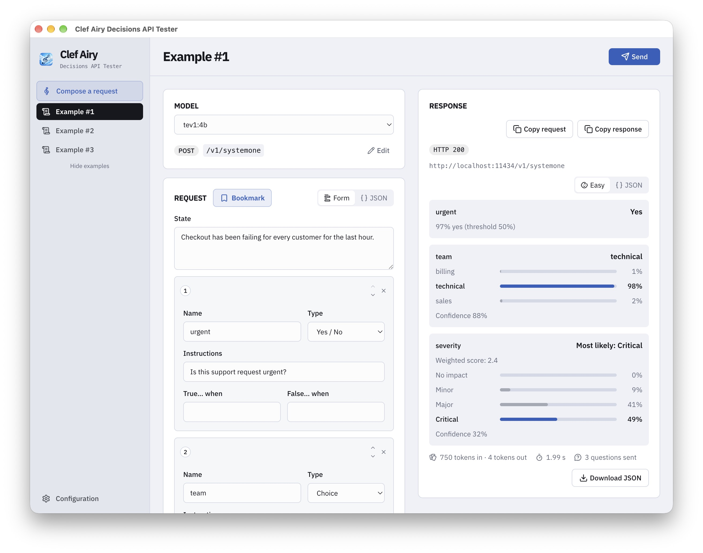

# Clef Airy Decisions API Tester: The Decision Conductor

**A native desktop workbench for Ollama System One & Jev Decision APIs.**

## Install and run

Download your installer from [GitHub Releases](https://github.com/ajdunn2/clef-airy/releases/):

- **Mac Apple Silicon (M-series):** `*-arm64.dmg`
- **Mac Intel:** `*-x64.dmg`
- **Windows:** `*-setup.exe`

### macOS

Open the `.dmg`, drag **Clef Airy Decisions** into **Applications**, then open it.

If macOS blocks it, run this in Terminal, then open the app again:

```bash
xattr -dr com.apple.quarantine '/Applications/Clef Airy Decisions.app'
```

### Windows

Run the `.exe` installer, then open **Clef Airy Decisions** from the Start menu.

In the app, save your API URL and model in **Configuration**, then open **Compose a request**. For local Ollama, make sure Ollama is running first.

## Configure your API and send a request

Save the API URL, pick a model, and choose no authentication, Basic credentials, or a Bearer API key. For [Jev](https://docs.typesafe.ai/api), use `https://api.typesafe.ai`, model `jev-latest`, and Bearer authentication with your TypeSafe key in the Password / API key field. In Compose a request, describe a situation and ask yes/no, choice, or score questions. You can edit the request as a form or as JSON, then read the answer in plain language or as JSON. Instructions and criteria fields also accept JSON objects and arrays.

The default API URL is `http://localhost:11434`. Leave the username and password blank when that server is a local [Ollama](https://ollama.com) install. Models are read from `GET /api/tags`. Requests go to `/v1/systemone`.

It works out of the box with these local Ollama models:

- `nimble`
- `tev1`
- `clef`
- `clef-flash`



## Technical information

The application uses [Laravel](https://laravel.com) and [NativePHP for Desktop](https://nativephp.com/docs/desktop/getting-started/introduction). The interface is built with Blade, Alpine.js, Tailwind CSS, and Vite; desktop data is stored in SQLite.

### Development requirements

- PHP 8.3 or newer
- Composer
- Node.js
- SQLite

### Set up from source

```bash
composer run setup
```

That installs PHP and JavaScript dependencies, copies `.env.example` to `.env` when needed, generates an application key, runs migrations, and builds the frontend.

### Run from source

In the browser:

```bash
composer run dev
```

As a desktop app, with Vite alongside NativePHP:

```bash
composer native:dev
```

### Tests

```bash
composer test
```

## Build desktop installers

### macOS

Quit Clef Airy Decisions API Tester before rebuilding. The build replaces the app bundle in `nativephp/electron/dist`; a running copy can lose files its PHP server is using.

For an Apple Silicon build:

```bash
php artisan native:build mac arm64 --no-interaction
```

For Intel Macs:

```bash
php artisan native:build mac x64 --no-interaction
```

Local builds without a signing identity use ad-hoc signing and are not notarized. If macOS blocks a build you created, remove its quarantine attribute before opening it:

```bash
xattr -dr com.apple.quarantine 'nativephp/electron/dist/mac-arm64/Clef Airy Decisions.app'
```

For an Intel build, use `dist/mac/` instead of `dist/mac-arm64/`. If your build has a different app name, use that name in the path.

Increment the app version in `config/nativephp.php`, or set `NATIVEPHP_APP_VERSION` in your local `.env`. NativePHP checks this version string on boot to run database migrations on installed copies.

Production builds remove `APP_ENV` and `APP_DEBUG` from the bundled environment. The app then runs in production with debug pages off.

The app stores its Laravel session key in an owner-only file in its application-data folder. Saved API passwords use OS-backed encryption (Keychain on macOS), independently of that file. Normal startup and viewing configuration do not read Keychain-saved passwords; saving or sending a password may request Keychain access. Older locally encrypted passwords are migrated to OS-backed storage when readable.

### Signed releases

For distribution, configure a Developer ID Application certificate and the `NATIVEPHP_APPLE_ID`, `NATIVEPHP_APPLE_ID_PASS` (app-specific password), and `NATIVEPHP_APPLE_TEAM_ID` variables in your local, ignored `.env`. See the [NativePHP build guide](https://nativephp.com/docs/desktop/2/publishing/building) for setup details.

```bash
NATIVEPHP_RELEASE=true php artisan native:build mac arm64 --no-interaction
```

Release mode requires signing and notarization credentials and stops the build if notarization fails. Artifacts are written to `nativephp/electron/dist`. Keep the bundle identifier stable between releases.

### Windows

After source setup, build the Windows x64 installer:

```bash
php artisan native:build win x64 --no-interaction
```

The installer is written to `nativephp/electron/dist` as `*-setup.exe`. Windows builds use `public/icon.ico`. The configured prebuild hook uses `cp`, so builds on Windows need a shell that provides it, such as Git Bash.

## Upgrading NativePHP

This repo publishes `nativephp/electron` so the app can keep its signing rules, local encryption key, and macOS privacy strings. After `composer update` replaces `nativephp/desktop`, put the new shell in place and reapply those changes:

```bash
php artisan electron:republish
```

The command copies the installed Electron project, applies `nativephp/electron-customizations.patch`, restores the package name and plugin build scripts, and copies `public/icon.png`, `public/icon.icns`, and `public/icon.ico` into `nativephp/electron/build`. Pass `--install` when the upgrade changes Electron's npm dependencies. Update the patch when you change those Electron files.

## License

Clef Airy Decisions API Tester is open-source software licensed under the [MIT license](https://opensource.org/licenses/MIT).
